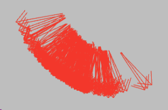
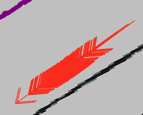

# AMCLのパラメータ調整方法_1

最初に調整するべきパラメータは`odom_alpha1`~`odom_alpha4`で, これらがデフォルト値のままでは自己位置推定が安定しにくいです.      
ここでは端的にそれらのパラメータの意味を説明し, その調整方法を述べます.  

---

## パラメータの説明([参考](http://wiki.ros.org/amcl#Parameters))
下記パラメータを大きくすればするほどオドメトリを信用しなくなります.  
反対に小さくすればオドメトリを信用しますが, 屋外だとオドメトリ誤差は大きくなるので注意してください.  
また, `odom_alpha1`, `odom_alpha4`はロボットが回転しているとき(カーブを走行しているときではない), パーティクルを膨張/収縮させるパラメータです. そのため, 回転よりも並進の動きが多い自律走行においては, あまりその効果を発揮しないことが多いです. [回転時には発揮することを確認するための動画](https://youtu.be/rg_rXQvE8Ao)を見ていただくと, 限られた条件下ではそのパラメータに意味があることを確認できます.   
一方, 効果を発揮し, 自己位置推定の正確さに直結するパラメータは`odom_alpha2`, `odom_alpha3`です.  
### `odom_alpha1`
- **意味**: ロボットの動きの回転成分から予想される回転推定におけるノイズ *(default: 0.2)*
### `odom_alpha2`
- **意味**: ロボットの動きの並進成分から予想される回転推定におけるノイズ *(default: 0.2)*  
- 並進時, 下の図のようにパーティクルを膨張/収縮させるためのパラメータです  
  

### `odom_alpha3`
- **意味**: ロボットの動きの並進成分から予想される並進推定におけるノイズ *(default: 0.2)*
- 並進時, 下の図のようにパーティクルを膨張/収縮させるためのパラメータです  
  

### `odom_alpha4`
- **意味**: ロボットの動きの回転成分から予想される並進推定におけるノイズ *(default: 0.2)*  

---

## 調整方法

### 1. rosbagの記録
まず, `rosbag`を記録します. navigation時とコントローラ操作時の両方を記録することが望ましいです. このとき, 上記パラメータはデフォルト値, もしくはそれ以下の値に設定してください. 

```bash
$ rosbag record -a
```

自己位置が破綻したら, `Ctrl+C`で記録を終了します.  

---

### 2. Rvizでパーティクルの散らばり等を確認
Rvizを使用して, パーティクルの散らばりや自己位置のずれ方を確認します. これにより, どのパラメータに問題があるかをある程度予想します.  

#### コマンド例:
##### 過去のデータを再生して確認
- 過去のデータをそのまま確認します
- 再生するrosbagファイルはnavigation時のもの
```bash
# 端末1
$ roscore

# 端末2
$ cd ~/catkin_ws/src/orne-box/orne_box_navigation_executor/rviz_cfg
$ rviz -d nav.rviz

# 端末3
$ rosbag play rosbagファイル名
```

##### オフラインで自己位置推定を行って確認
- 上記の方法とは異なり, パラメータを実際に変更しながらパーティクルの変化を確認することができます 
- 再生するrosbagファイルはコントローラ操作時のもの
  - navigation時のrosbagファイルでもできないことはないのですが, tfが重複しRviz画面が見づらいです
- 下記の[only_localization.launch](https://github.com/YuseiShiozawa/orne-box/blob/test4/orne_box_navigation_executor/launch/only_localization.launch)は私が適当に作った, localizaion(AMCL, EMCL, EMCL2のいずれか)とRvizを同時に立ち上げるものです. 割と便利な気がするのでコピペして活用してください 
  - AMCLとRvizが立ち上がればなんでもいいです
```bash
# 端末1
$ roslaunch orne_box_navigation_executor only_localization.launch 

# 端末2
$ rosbag play rosbagファイル名 --topics /tf /tf_static /scan
```


---

### 3. 問題の特定とパラメータ調整
そもそもの話にはなりますが, 地図が信頼できる（実環境で変化が起こりにくい）場合は, スキャンデータも信頼性が高くなるため, パラメータをある程度大きく設定しても自己位置推定は安定します.  
一方, 地図が信頼できない場合は, できる限り上記のパラメータを下げる(オドメトリを信頼する)と, 自己位置推定が安定します. ただし, オドメトリを過度に信頼すると, 特に屋外では誤差が累積しやすいため, 結果として自己位置破綻に繋がります. このトレードオフの関係を見極めるのが調整の難しいところです. 

#### a. 並進方向のずれ
以下の図のように並進方向にずれている場合, `odom_alpha3`の値を調整します.    
ずれていても正しい位置に復帰できれば問題ありませんが, 根本的な解決を目指すべきです.  

- 具体的には, `odom_alpha3`の値を大きくしていきます(0.05 ~ 0.1ずつ)  
- おそらくこのような並進方向のずれが発生する場合は, 他の箇所でも複数似たようなことが起きると思います
- 値を徐々に大きくし, 並進方向のずれが発生する箇所が減ることを確認してください  
  - 発生する箇所を0にするのはかなり難しいと思います
  - 大きくしすぎると自己位置推定が破綻するので注意してください   
  

#### b. 回転(横)方向のずれ
以下の図のように回転方向にずれている場合, `odom_alpha2`の値を調整します.  
こちらも同様に, ずれていても正しい位置に復帰できれば問題ありませんが, 根本的な解決を目指すべきです.  

- 具体的には, `odom_alpha2`の値を大きくしていきます(0.05 ~ 0.1ずつ)  
- おそらくこのような回転方向のずれが発生する場合は, 他の箇所でも複数似たようなことが起きると思います
- 値を徐々に大きくし, 回転方向のずれが発生する箇所が減ることを確認してください  
  - 発生する箇所を0にするのはかなり難しいと思います
  - 大きくしすぎると自己位置推定が破綻するので注意してください  
  

#### c. 自己位置が徐々にずれていく
以下の図のように, 自己位置が徐々にずれていく場合, `odom_alpha1`~`odom_alpha4`の値(特にalpha2, 3)を小さくする必要があります. パーティクルが広がり, 推定される自己位置の範囲を制限するためです.  
- 具体的には, `odom_alpha1`~`odom_alpha4`の値を小さくしていきます(0.05 ~ 0.1ずつ) 
---
 
