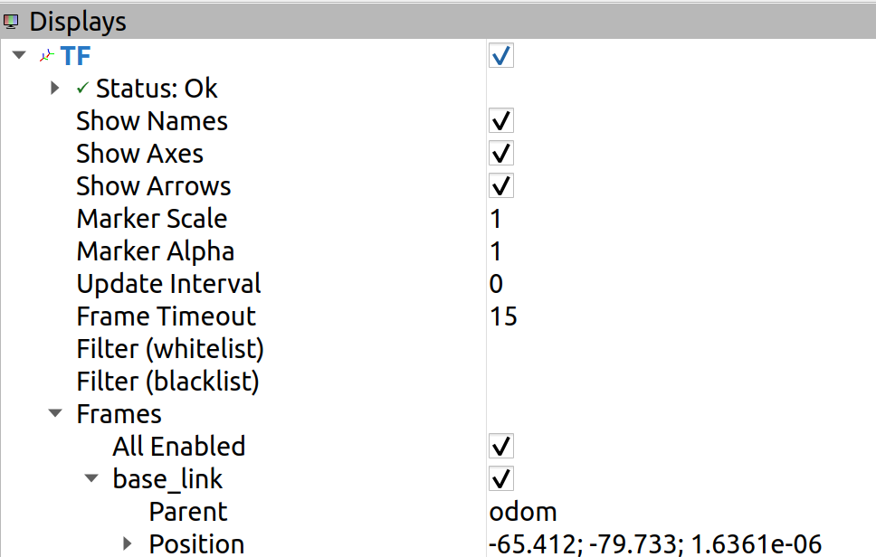

# AMCLのパラメータ調整方法_2
ここでは, [AMCLのパラメータ調整方法_1](./amcl_1.md)で説明しなかった, **調整の優先度が低いパラメータ**について説明します. 

## パラメータの説明([参考](http://wiki.ros.org/amcl#Parameters))
### `min_particles`
- **意味**: 最小パーティクル数 *(default: 100)*
### `max_particles`
- **意味**: 最大パーティクル数 *(default: 5000)*
### `kld_err`
- **意味**: 推定位置の最大誤差 *(default: 0.01)*
### `kld_z`
- **意味**: パーティクルの信頼度係数 *(default: 0.99)*
### `update_min_d`
- **意味**: フィルタの更新を実行するために必要な距離(m) *(default: 0.2)*
### `update_min_a`
- **意味**: フィルタの更新を実行するために必要な回転角度(rad) *(default: π/6.0)*
### `transform_tolerance`
- **意味**: amclに必要な入力トピックの時間誤差の許容値(s) *(default: 0.1)*
### `initial_pose_x`
初期座標x *(default: 0.0)*
### `initial_pose_y`
初期座標y *(default: 0.0)*
### `initial_pose_a`
初期ヨー角 *(default: 0.0)*
### `laser_z_hit`
モデルの z_hit 部分の混合重み *(default: 0.95)*
### `laser_z_short`
モデルの z_short 部分の混合重み *(default: 0.1)*
### `laser_z_max`
モデルの z_max 部分の混合重み *(default: 0.05)*
### `laser_z_rand` 
モデルの z_rand 部分の混合重み *(default: 0.05)*

---

## パラメータ調整/設定  
### ⚠ 注意点
これらのパラメータを調整すると, 結果として[AMCLのパラメータ調整方法_1](./amcl_1.md)で調整した**パーティクルの広がり方**にも影響するため, 設定時には注意が必要です. また, これらのパラメータは, **デフォルト値でも津田沼チャレンジのコースは完走可能であることを確認済み**です.

- `min_particles`, `max_particles`  
パーティクル数は多ければ精度が上がるとは限らず, **CPU負荷が増える**ので注意が必要です. 

- `kld_err`, `kld_z`  
これらはパーティクル数の自動調整に関係するパラメータで, **変更するとパーティクルの広がりが大きく変化します.** `kld_err`を大きくしたり, `kld_z`を小さくすると, パーティクルが膨張します. [AMCLのパラメータ調整方法_1](./amcl_1.md)の調整が適切であれば調整の必要はないと思います.  

- `update_min_d`, `update_min_a`  
パーティクルの更新頻度です. 値を小さくすれば, 頻繁に更新されますが, **CPUの負荷が大きくなります.** ただ過度に大きくすると, 自己位置推定の役割がなくなるので, 注意してください.   

- `transform_tolerance`  
たとえば、3D-LiDARの`pointcloud`を`laserscan`に変換して使用する場合, **処理時間の遅延がAMCLの動作に悪影響を及ぼす**ことがあります. この許容値が小さすぎると, **AMCLが動作せず, ROSWARNが出る**ことがあります.（詳しくは[こちら](./amcl_roswarn.md)）

- `initial_pose_x`, `initial_pose_y`, `initial_pose_a`  
自己位置の初期値を設定します. Rviz上の操作(2D Pose Estimate)で手動設定することもできますが, 津田沼チャレンジなど, スタート位置が固定されている場合は事前設定すると便利です.  
初期位置は, RvizでTFからbaselink等の`Position`(左からx, y, a)を参照して設定してください.  
   

- `laser_z_hit`, `laser_z_short`, `laser_z_max`, `laser_z_rand`  
センサーモデルの重みバランスを構成するパラメータで, これらも変更すると**パーティクルの広がり方に大きく影響**します.  
基本的にデフォルトのままで問題ありません.  

---

## ✅ まとめ
- これらのパラメータは基本的に微調整向きです
- 初期状態で動作が安定していれば, 大幅にいじる必要はありません
- 変更する場合は, [AMCLのパラメータ調整方法_1](./amcl_1.md)での調整結果との整合性に注意してください

