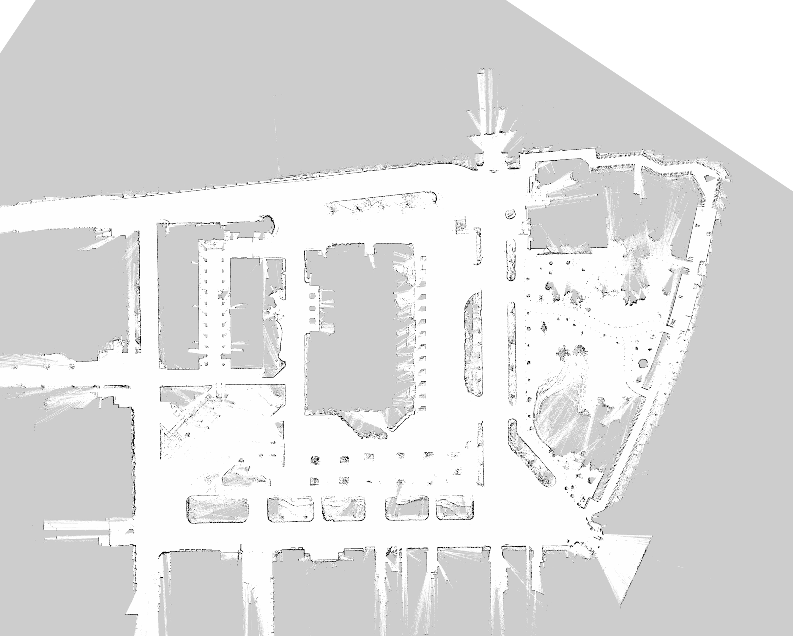

# 地図の作り方_1
ロボットを安定して自律移動させるためには, **正確な地図の作成が不可欠**です.  
ここでは, 代表的な2つの地図作成手法を紹介します.  

---

## 方法1: 二次元地図の作成
例: [slam_toolbox](https://github.com/SteveMacenski/slam_toolbox)  
- 比較的簡単に2D地図を作成できます
- オンライン（実ロボットで走行しながら）・オフライン（rosbagから）どちらにも対応
- 2D-LiDARまたは3D-LiDAR(`pointcloud_to_laserscan`あり)を使用  

詳細は[こちら](./slam_toolbox.md)  
   

## 方法2: 三次元地図の作成後, スライスして二次元地図を作成
例: [glim](https://github.com/koide3/glim) + [pointcloud2pgm_slicer](https://github.com/cafeline/pointcloud2pgm_slicer)  
- 3D-LiDARを用いて3D地図を作成
- 作成した3D点群を任意の高さでスライスし, 2D地図に変換
- オフラインでの実行
- **GPUなし環境では処理負荷が高くなるため注意**

詳細は[こちら](./glim.md)  
   

