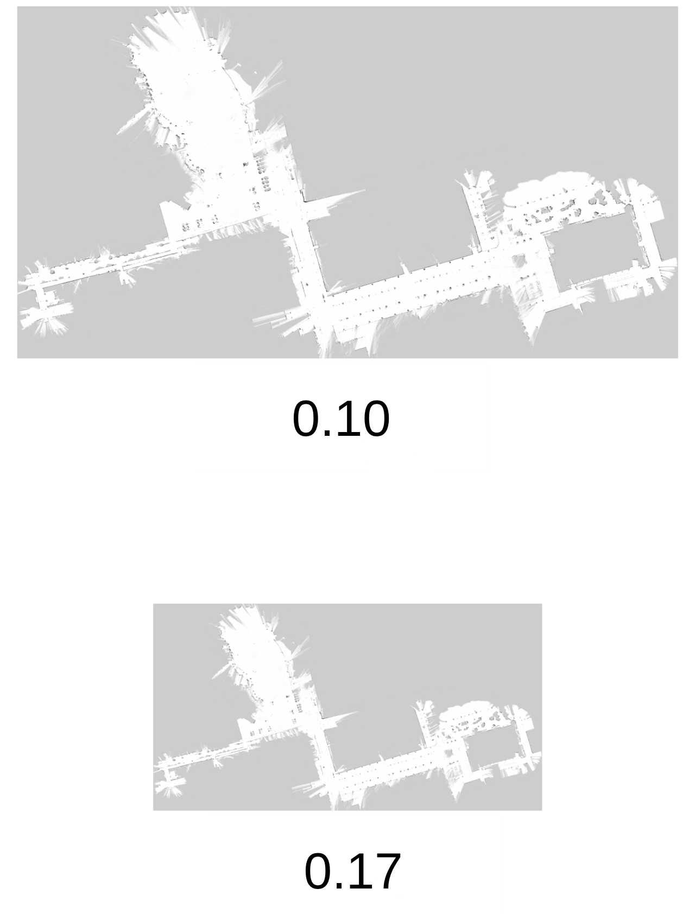

# 大規模屋外環境での地図解像度設定
## はじめに
つくばチャレンジのような**大規模屋外環境での自律移動**においては, 使用する地図の総セル数が極端に増加するため, 経路計画で使用されているDijkstra法の計算速度に大きく影響します. 実際につくばチャレンジ2025の最初の実験走行では, その計算領域が増えたことで, **ロボットは停止を繰り返していました**.  
ここでは, その問題を解消するための考え方をまとめています. 

## map_serverで扱われる地図
`map_server`で扱われる地図は, 格子(セル)で構成されています.  
また, 1セルあたりの距離[m]は`resolution`で定義されます. 

## resolution(解像度)
`resolution`を大きく設定するほど, 1セルが表す距離が広がり, 結果として地図全体の計算領域が減少します.  
極端な例↓
|  | resolution 低い | resolution 高 |
|------|--------------------------|--------------------------|
| 格子の細かさ | 細かい | 粗い |
| 総セル数 | 多い | 少ない |
| 計算量 | 多い | 少ない |

## つくばチャレンジ2025での例
地図のスケール変更による修正↓

| | 画像サイズ [pixel] | 総セル数 | 備考 |
|------|--------------------|-----------|------|
| 修正前 | 7077 × 3773 | 約2669万 | resolution = 0.10 |
| 修正後 | 4163 × 2219 | 約924万 | resolution = 0.17 |

➡ 約 **65% の計算領域の削減** により, 
経路探索（Dijkstra法）の計算量を大幅に低減でき, ロボットが停止を繰り返す問題は解消できました. 
下の図は`resolution`が0.10, 0.17のときの地図です. 

## 注意点
解像度を上げすぎると, 自己位置推定が不安定になったり, 狭い通路が潰れてしまって通行不可とされてしまうことがあります. そのため, 極端に`resolution`を上げることは避けたほうが良いです. 
