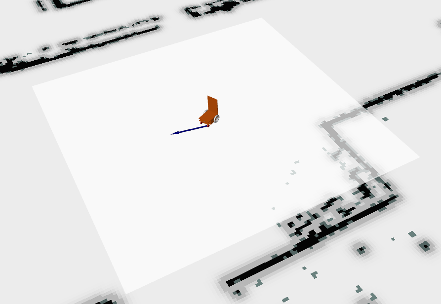
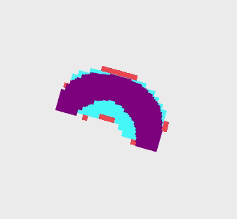
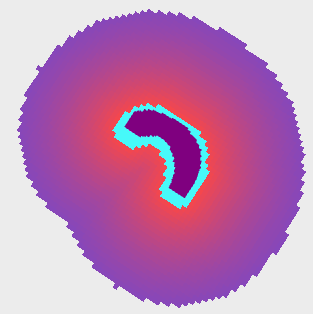
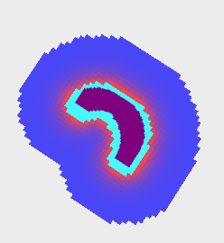
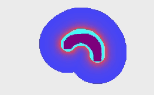

# costmapのパラメータ  
デフォルト値のままでも動きはするので, 必要に応じて(障害物を避けることができない等)変更してください. なお, `costmap_common_params.yaml`で定義しているパラメータがあれば, デフォルト値はそこで指定した値になります.  

## パラメータの説明([参考](https://robo-marc.github.io/navigation_documents/costmap_2d.html#costmap2d-parameters))
localとglobalで重複しているパラメータが多いですが, 各名前空間で定義することで, それぞれの役割に合ったパラメータを指定できます.  
### local_costmap
#### `update_frequency`  
- **意味**: マップの更新周波数(Hz) *(default: 5.0)*  
#### `width`
- **意味**: マップの幅 *(default: 10)*
#### `height`
- **意味**: マップの高さ *(default: 10)*
#### `inflation_radius`
- **意味**: 障害物のコスト値をインフレーションする半径 *(default: 0.55)*
#### `cost_scaling_factor`
- **意味**: インフレーション時にコスト値に適用するスケーリング係数 *(default: 10)*
#### `resolution`
- **意味**: マップの解像度 *(default: 0.05)*

---
### global_costmap 
#### `update_frequency`  
- **意味**: マップの更新周波数(Hz) *(default: 5.0)*  
#### `inflation_radius`
- **意味**: 障害物のコスト値をインフレーションする半径 *(default: 0.55)*  
#### `cost_scaling_factor`
- **意味**: インフレーション時にコスト値に適用するスケーリング係数 *(default: 10)*  
#### `resolution`
- **意味**: マップの解像度 *(default: 0.05)*  

## パラメータ調整/設定
### local_costmap_params.yaml 
- `update_frequency`  
マップの更新頻度を調整します. 大きくしすぎると, 動的な障害物をコストに反映できなくなるので注意が必要です. 反対に小さくしすぎると, 過度にCPUに負荷をかけることになるので注意.  

- `width`, `height`  
local_costmap(下図の明るい正方形の部分)の大きさを調整します. 大きな値にすれば遠くの障害物も前もってコストに反映できますが, その分計算量が増えるので注意が必要です.  
    

- `inflation_radius`  
下図のようにコストを膨張させる度合いを調整します. `cost_scaling_factor`の値によって膨張させる範囲の制限がかかるので注意が必要です.  
  

- `cost_scaling_factor`  
下図は, どれも`inflation_radius`が同じ値のときに, `cost_scaling_factor`の値を変更した図ですが, コストのスケールが変更されていることが分かります. この値を大きくしすぎると, `inflation_radius`の値を変更しても, 極端に限られた範囲でしかコストを膨張させることができないで注意が必要です.    
cost_scaling_factor= 1.0  
  
cost_scaling_factor = 10  
  
cost_scaling_factor= 20  
  

- `resolution`  
下図のようにコストの解消度を調整します.  
  

---
### global_costmap_params.yaml
- `update_frequency`  
local_costmapで記述した内容と同じ  

- `inflation_radius`  
local_costmapとは違い, 下図のように, static_layerで登録されているマップ全体のコストを膨張させます.  
  

- `cost_scaling_factor` 
local_costmapで記述した内容と同じ

- `resolution` 
local_costmapで記述した内容と同じ

---
他の調整↓
- [Move baseのパラメータ](move_base_1.md)
- [recovery_behaviorのパラメータ](recovery_behavior.md)
- [local_plannerのパラメータ](local_planner.md)
- [global_plannerのパラメータ](global_planner.md)