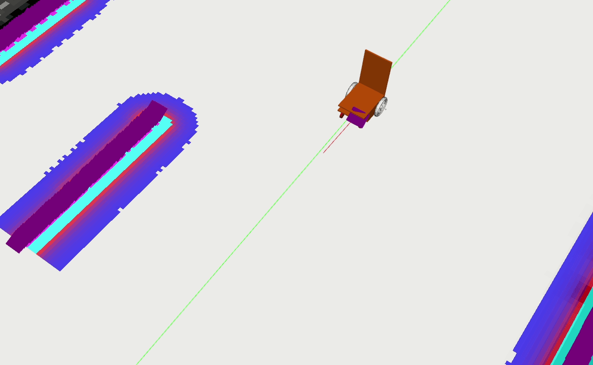
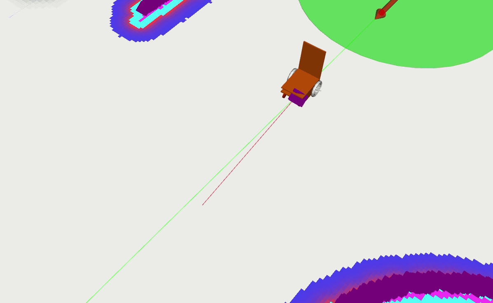

# local_plannerのパラメータ  
ここでは, ローカルプランナーとして`base_local_planner/TrajectoryPlannerROS`を使用していることを前提に, 主なパラメータの意味と調整方法について説明します.  
他のプランナー（DWAPlannerROS等）にも同名または類似のパラメータが存在し, 多くの場合同様の意味を持ちます.  

## パラメータの説明([参考](http://wiki.ros.org/base_local_planner#TrajectoryPlannerROS))  
下記パラメータは, 選択したlocal_plannerの名前空間で定義してください.  
### `acc_lim_x`
- **意味**: ロボットの縦方向の最大加速度(m/s^2) *(default: 2.5)*  
### `acc_lim_theta`
- **意味**: ロボットの回転方向の最大加速度(rad/s^2) *(default: 3.2)*  
### `max_vel_x`
- **意味**: ロボットの縦方向の最大速度(m/s) *(default: 0.5)*  
### `min_vel_x`
- **意味**: ロボットの縦方向の最小速度(m/s) *(default: 0.1)*
### `max_vel_theta` 
- **意味**: ロボットの回転方向の最大速度(rad/s) *(default: 1.0)*
### `min_vel_theta`
- **意味**: ロボットの回転方向の最小速度(rad/s) *(default: -1.0)*
### `min_in_place_vel_theta`
- **意味**: その場で旋回するときの回転方向の最小速度(rad/s) *(default: 0.4)*
### `escape_vel`
- **意味**: 脱出動作中, ロボットが後退するときの速度(m/s) *(default: -0.1)*
### `escape_reset_dist`
- **意味**: 脱出動作が解除されるまでにロボットが移動する必要がある距離(m) *(default: 0.1)*  
### `escape_reset_theta`
- **意味**: 脱出動作が解除されるまでにロボットが回転する必要がある角度(rad) *(default: 0.5 * π)*  
### `yaw_goal_tolerance`
- **意味**: ロボットが目標地点に到達するときの, 向きの許容誤差(rad) *(default: 0.5)*  
### `xy_goal_tolerance`  
- **意味**: ロボットが目標地点に到達するときの, 距離の許容誤差(m) *(default: 0.10)*  
### `sim_time`  
- **意味**: 軌道をフォワードシミュレーションする時間(s) *(default: 1.7)*  
### `meter_scoring`
- **意味**: `gdist_scale`, `pdist_scale`がメートル単位で表されるか否かのパラメータ, falseの場合はセル単位 *(default: false)*  
### `pdist_scale` 
- **意味**: ロボットがどれだけパスに沿って動こうとするかの重み *(default: 0.6)*  
### `gdist_scale`  
- **意味**: ロボットがローカルの目標にどれだけ近付こうとするかの重み *(default: 0.8)*  
### `occdist_scale`  
- **意味**: ロボットが障害物をどれだけ回避しようとするかの重み  *(default: 0.01)* 
---
## パラメータ調整/設定  
- `acc_lim_x`, `acc_lim_theta`  
それぞれ加速度に関わるパラメータです. orne-boxでは, 特に変更する必要はないように思います.  

- `max_vel_x`, `min_vel_x`, `max_vel_theta`, `min_vel_theta`, `min_in_place_vel_theta`  
最大/最小速度に関わるパラメータです. `max_vel_x`に関しては, orne-boxではデフォルト値よりやや高め(0.8 ~ 1.0)にしないと, 自律走行時やや遅すぎるように思います.  

- `escape_vel`
ロボットを障害物の回避等で**後退**させたい場合は負の値である必要があります.  

- `escape_reset_dist`, `escape_reset_theta`  
どちらかが満たされれば脱出動作は解除されます. デフォルトではかなり解除されやすくなっているので, 必要に応じて大きくしてください.  

- `yaw_goal_tolerance`, `xy_goal_tolerance`  
これらのパラメータは, waypointの到達判定許容値ではなく, **Move Baseが**「ゴールに到達した」と判定するときの許容誤差です. 基本的にデフォルト値で問題ありません.  
変更する場合は以下のことに気をつけてください. ここで重要なのは, **Move Baseがゴール到達と判断しても, waypoint側の到達判定が満たされていなければ, 次の経路が生成されない**という点です.  
  - ❗何が問題か？  
`yaw_goal_tolerance`, `xy_goal_tolerance` の値を過度に大きくすると, Move Baseが「ゴールに到達した」と判断するため, ロボットはwaypointの手前で停止します.    
しかし実際には, ロボットがwaypointの手前で止まっているにもかかわらず, waypoint側では「まだ到達していない」と判断されるため, 次の経路が生成されません. ([動画](https://youtu.be/pV3Lr9YbwB4?si=zQRxNWCGK4WMX8jU)) このとき, **エラーや警告は一切出ません.** これが非常に厄介な点です.  
waypointへの到達判定を変更するには`waypoint_server/config/waypoint_server.yaml`の`default_goal_radius`, `set_goal_radius`の値を変更してください.  

- `sim_time`
local_plannerがどれだけ先までパスを生成するかのパラメータですが, 大きくすると極端に`CPUに負荷をかける`ことになります.  
下の図の赤い線が生成されるローカルパスです. (左図が`1.7`, 右図が`3.4`のとき)  
     

- `meter_scoring`  
`true`にすればメートル単位で直感的に調整可能になります. `false`だとコストマップのセル単位です.  

- `pdist_scale`, `gdist_scale`, `occdist_scale`  
それぞれパスの追従性に関わる重みパラメータです. **デフォルト値のままで問題ない**ように思います.  
仮にロボットが「障害物にぶつかりそうになる」「うまく通路を抜けられない」といった挙動をする場合, まずはコストマップの設定（例えばinflation_radiusやcost_scaling_factorなど）を見直すべきです.  
**これらの重みパラメータだけで問題を解決しようとするのは難しい**ように思います.  
  - `pdist_scale`  
  大きくすると障害物回避に弱くなりますが, グローバルパスの追従性は上がります.  
  - `gdist_scale`  
  大きくすると, グローバルパスの追従性は下がりますが, 障害物を大きく回避できます.  
  - `occdist_scale`  
  大きくすると, 障害物をそもそも回避しなくなるので注意が必要です.  

---
次の調整↓
- [Move baseのパラメータ](move_base_1.md)
- [recovery_behaviorのパラメータ](recovery_behavior.md)
- [costmapのパラメータ](costmap.md)
- [global_plannerのパラメータ](global_planner.md)