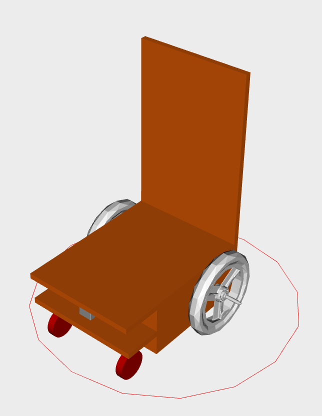

# Move Baseのパラメータ調整方法_0
`move_base`ノードを問題なく動作させるためには, いくつかのパラメータを最低限調整/設定する必要があります.  
ここでは端的にそれらのパラメータの意味を説明し, その設定値を述べます. 

## パラメータの説明([参考](http://wiki.ros.org/costmap_2d))
### costmap_2d
#### common
##### `footprint`
- **意味**: ロボットの形状を定義するためのパラメータ *(default: use `robot_radius`, default: 0.46)*
##### `publish_frequency`
- **意味**: Rvizで可視化するためのパブリッシュ周波数 *(default: 0.0)*
##### `observation_sources`
- **意味**: センサの名前リスト, 名前空間の定義 *(default: "")*
##### `data_type`(`observation_sources`で定義した名前空間内で)
- **意味**: トピックに関連付けられているデータ型 *(default: PointCloud)*
##### `clearing`(`observation_sources`で定義した名前空間内で)
- **意味**: 障害物がなくなった場所を地図上から消すためのパラメータ *(default: false)*
#### local
##### `rolling_window`
- **意味**: ローリングウィンドウバージョンのコストマップを使用するかどうか *(default: false)*
- `static_map`パラメータがtrueに設定されている場合, このパラメータは`false`に設定する必要がある
#### global
##### `map_topic`
- **意味**: コストマップが静的マップをサブスクライブするトピック名 *(default: map)*
##### `static_map`
- **意味**: グローバルコストマップにおいて、`map_server` から提供される静的マップを使用するためのパラメータ *(default: false)*

## 必須のパラメータ調整/設定
### costmap_common_params.yaml
- `footprint`  
設定しないと, ロボットのfootprintは下の図の赤線のように円形となってしまいます. このままでは, 突然スタック状態に陥る等の問題が起こり得ます.  
  
[orne-box](https://github.com/open-rdc/orne-box)では, `footprint: [[0.433, 0.254], [-0.187, 0.254], [-0.187, -0.254], [0.433, -0.254]]`とすることで, 下の図のようにロボットモデルにあった設定ができます.   
   

- `publish_frequency`  
設定しないと, Rvizでのコストマップの可視化ができません. このパラメータの単位は`Hz`なので適当に`2.0`など, デフォルト値よりも大きな値にしてください. 

- `observation_sources`  
設定しないと, 地図にない障害物をコストへ反映できません. センサデータが入力されるトピック名(`scan`等)に設定してください.  
- `data_type`  
`observation_sources` の名前空間内で定義します. トピックのデータ型がデフォルト値の`PointCloud`であれば設定しなくても問題ありませんが, `LaserScan`等, 異なるのであれば設定してください.  
- `clearing`  
`observation_sources` の名前空間内で定義します. 設定しないと, 障害物がなくなっても地図から障害物を消してくれません. それは困るので`true`に設定してください.  

例
```
footprint: [[0.433, 0.254], [-0.187, 0.254], [-0.187, -0.254], [0.433, -0.254]]
publish_frequency: 2.0
observation_sources: scan
scan: 
  {
    data_type: LaserScan,     
    clearing: true,   
  }

```
### local_costmap_params.yaml
- `rolling_window`  
公式のドキュメント(下記[引用](https://robo-marc.github.io/navigation_documents/costmap_2d.html#costmap2d-static-map-layer))の指示に従いましょう. ということで, local_costmapでは`static_map`を使わないので`true`にします.  
> `static_map`パラメータがtrueに設定されている場合, このパラメータは`false`に設定する必要がある.  

例
```
local_costmap:       
  rolling_window: true   
```


### global_costmap_params.yaml
- `map_topic`  
コストマップと自己位置推定で異なる地図を使用したい場合, コストマップ用のトピック名を指定してください. 

- `static_map`  
設定しないと, 静的マップを使用できません. `true`にしてください. しかし, この設定方法ではナビゲーション中にマップの切り替えを行うことができません. マップの切り替えを行いたい場合は, `false`に設定し, 代わりに`static_layer`プラグインで`map_topic`を指定する必要があります.  

例1
```
global_costmap:
   map_topic: map_for_costmap 
   static_map: true 
```  


例2  
```
global_costmap:
   plugins:
    - name: StaticLayer
      type: costmap_2d::StaticLayer
    - name: inflationlayer
      type: costmap_2d::InflationLayer
   StaticLayer: 
     map_topic: map_for_costmap
```